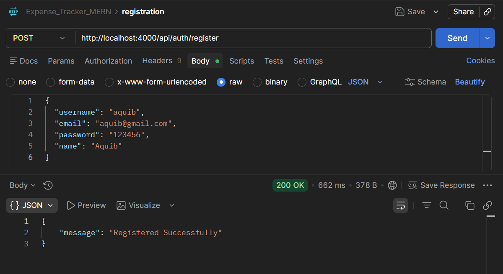
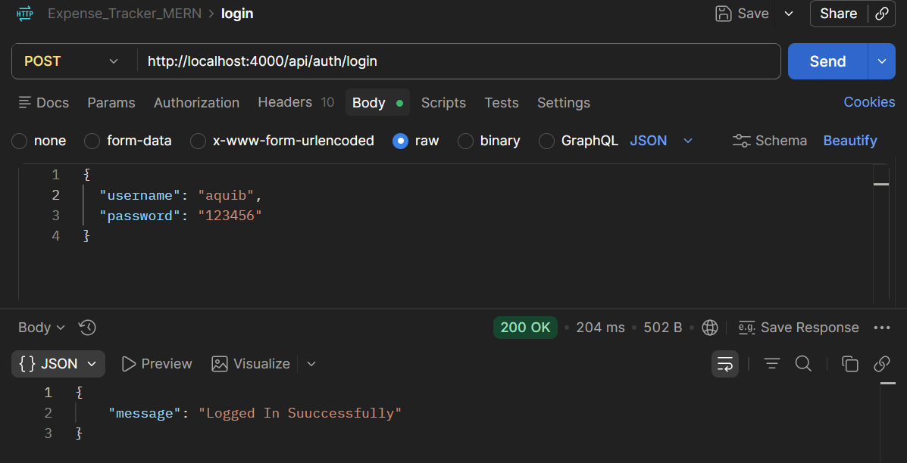
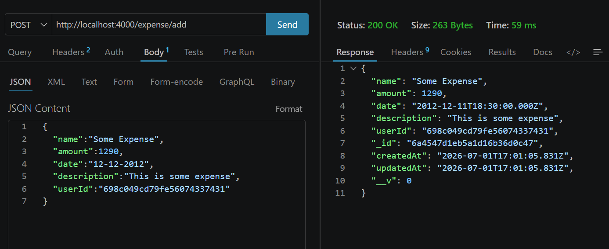
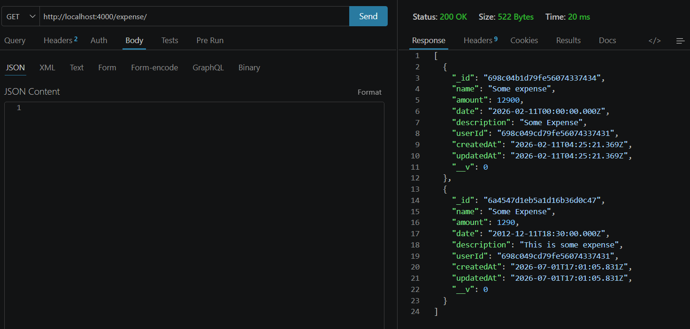

# Expense Tracker Backend API

A secure and scalable RESTful backend application for managing personal expenses. This project enables users to securely register, authenticate, and manage their expenses using JWT authentication while following MVC architecture and backend development best practices.

---

## Features

- User Registration
- User Login Authentication
- JWT-Based Authentication
- Password Hashing using bcrypt
- HTTP-Only Cookie Authentication
- Protected Routes using JWT Middleware
- Expense Management (CRUD Operations)
- Input Validation
- MongoDB Database Integration
- RESTful API Development
- MVC Architecture
- Error Handling

---

## Tech Stack

| Category | Technologies |
|----------|--------------|
| Backend | Node.js, Express.js |
| Database | MongoDB, Mongoose |
| Authentication | JWT (JSON Web Token) |
| Security | bcrypt, HTTP-Only Cookies |
| API Testing | Postman, Thunder Client |
| Version Control | Git, GitHub |

---

## Project Structure

```text
expense-tracker-backend-api
│
├── controller/
├── db/
├── middleware/
├── model/
├── router/
├── screenshot/
├── app.js
├── package.json
├── package-lock.json
├── .gitignore
└── README.md
```

---

## Architecture

The project follows the MVC (Model-View-Controller) architecture.

- **Models** – Define MongoDB schemas using Mongoose.
- **Controllers** – Handle business logic and request processing.
- **Routes** – Define REST API endpoints.
- **Middleware** – Verify JWT tokens and protect authenticated routes.
- **Database** – MongoDB with Mongoose ODM.

---

## Authentication & Security

The application implements secure authentication using **JWT (JSON Web Tokens)**.

### Security Features

- Password hashing using bcrypt
- JWT token generation
- HTTP-Only Cookie Storage
- Protected API Routes
- Secure Logout
- Token Expiration (1 Day)
- Authentication Middleware

### Authentication Flow

1. User registers with username, email, name, and password.
2. Password is hashed using bcrypt before storing in MongoDB.
3. User logs in with valid credentials.
4. Server verifies the password using bcrypt.
5. JWT token is generated.
6. Token is stored in an HTTP-only cookie.
7. Protected routes validate the JWT before processing requests.
8. Logout clears the authentication cookie.

---

## API Endpoints

### Authentication APIs

| Method | Endpoint | Description |
|----------|----------|-------------|
| POST | `/api/auth/register` | Register a new user |
| POST | `/api/auth/login` | Authenticate user and generate JWT |
| POST | `/api/auth/logout` | Logout user |
| GET | `/api/auth/check-auth` | Verify authenticated user |

---

### Expense APIs

| Method | Endpoint | Description |
|----------|----------|-------------|
| GET | `/api/expenses` | Retrieve all expenses |
| POST | `/api/expenses` | Create a new expense |
| PUT | `/api/expenses/:id` | Update an existing expense |
| DELETE | `/api/expenses/:id` | Delete an expense |

---

## Installation

### Clone Repository

```bash
git clone https://github.com/AQUIB-IRFANI/Expense-Tracker-Backend-API.git
```

---

### Install Dependencies

```bash
npm install
```

---

### Environment Variables

Create a `.env` file in the project root.

```env
PORT=5000

MONGODB_URI=your_mongodb_connection_string

JWT_SECRET=your_secret_key

NODE_ENV=development
```

---

### Start the Application

```bash
npm start
```

---

## API Testing

The REST APIs were tested using:

- Postman
- Thunder Client

---

## Screenshots

### User Registration



### User Login



### Create Expense



### Get Expenses



---

## Key Learning Outcomes

Through this project, I gained practical experience in:

- Backend Development with Node.js and Express.js
- RESTful API Design
- JWT Authentication & Authorization
- Password Security using bcrypt
- HTTP-Only Cookie Authentication
- MongoDB Data Modeling
- Middleware Development
- MVC Architecture
- Error Handling
- API Testing using Postman
- Git Version Control
- Debugging and Refactoring

---

## Future Enhancements

- Expense Categories
- Monthly Expense Analytics
- Budget Planning
- Role-Based Authorization
- Docker Support
- Unit & Integration Testing
- Swagger API Documentation
- Email Notifications
- Expense Reports

---

## Author

**Aquib Muzzammil Irfani**

📧 Email: maquib1710@gmail.com

🔗 LinkedIn: https://linkedin.com/in/aquib-irfani-422746253

💻 GitHub: https://github.com/AQUIB-IRFANI
